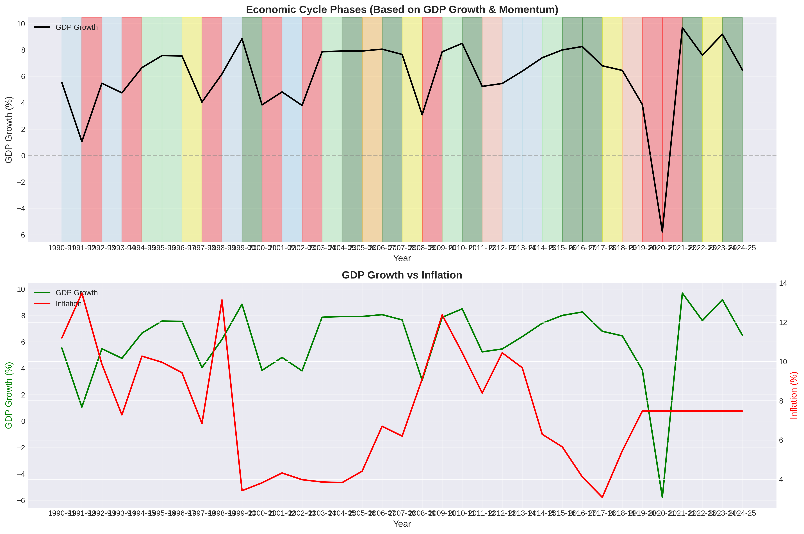
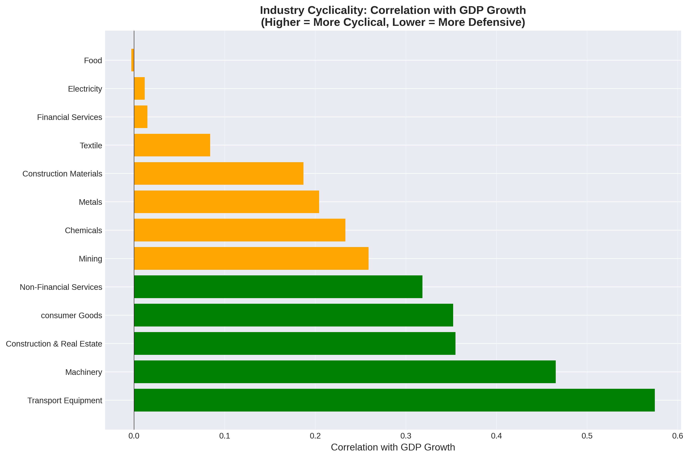
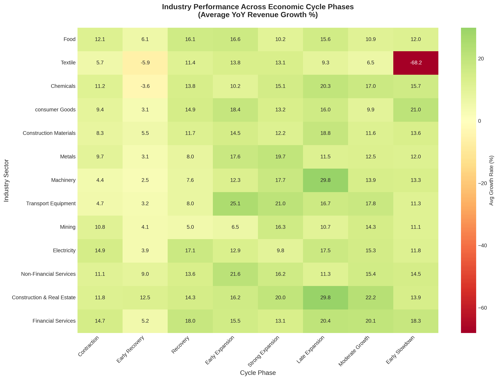
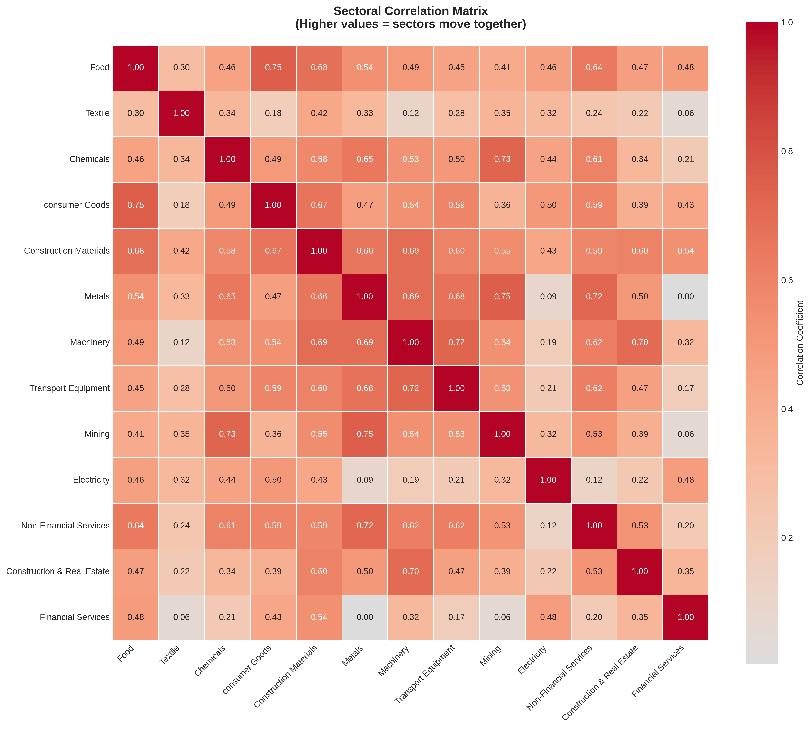
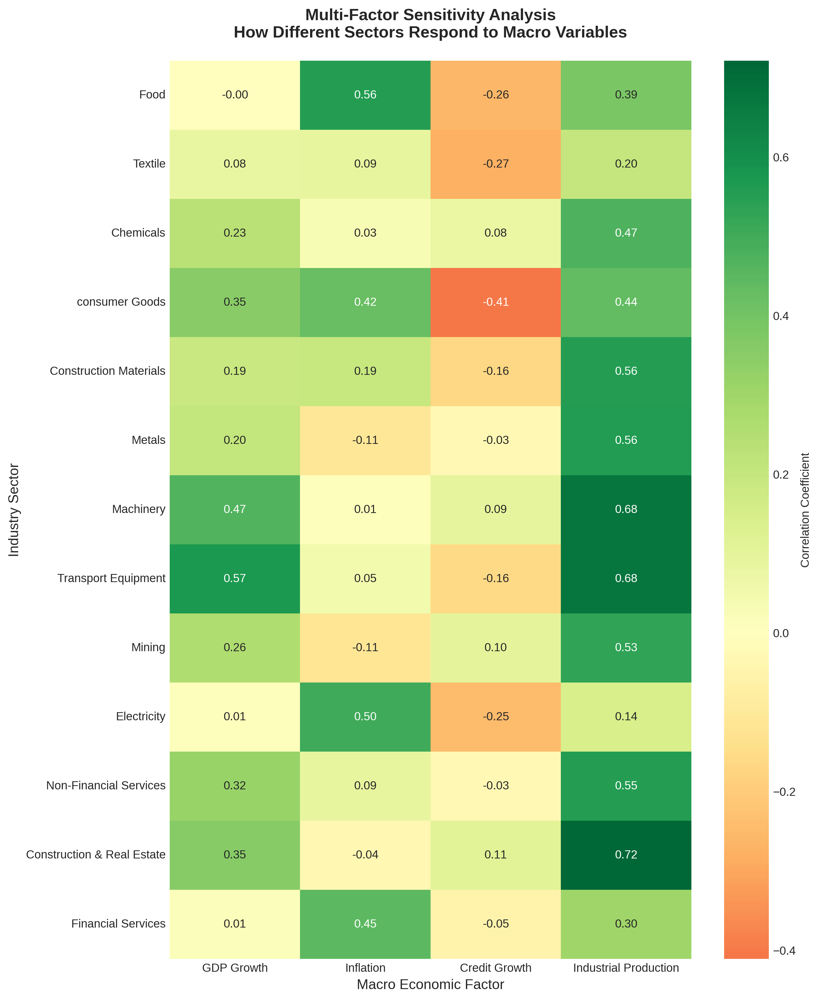
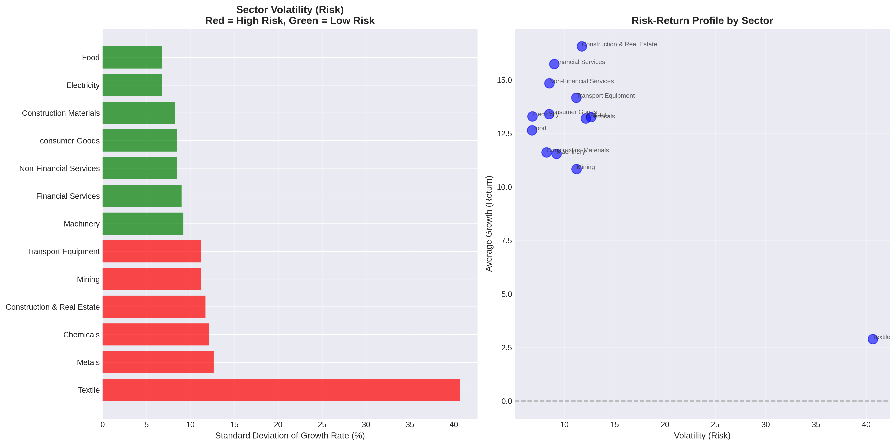
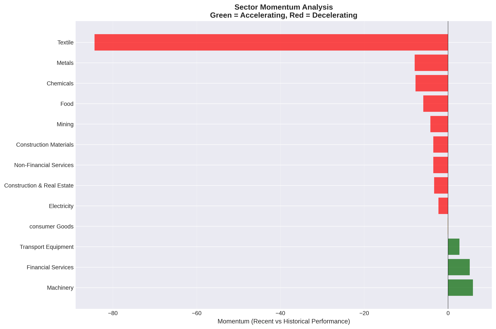

# Industry Rotation & Economic Cycle Analysis Tool

A comprehensive Python-based analytical framework for identifying economic cycle phases and optimizing sector allocation strategies using macroeconomic indicators and industry performance data.


## Project Overview

This tool addresses a fundamental challenge in portfolio management: **when should investors rotate between different industry sectors?** By analyzing the relationship between macroeconomic cycles and industry performance, this project provides data-driven insights for sector allocation decisions.

Built using CMIE Economic Outlook and Industry Outlook data for the Indian economy, the tool identifies economic cycle phases and reveals which sectors historically outperform or underperform in different economic environments.

### Why This Matters

- Different industries perform differently across economic cycles
- Defensive sectors (e.g., Pharmaceuticals, Consumer Staples) hold up during slowdowns
- Cyclical sectors (e.g., Metals, Transport Equipment) surge during expansions
- Understanding these patterns enables strategic sector rotation for better risk-adjusted returns


## Key Features

### Economic Cycle Analysis
- **Automated cycle phase identification** using GDP growth and momentum
- Classification into 8 distinct phases: Strong Expansion, Early Expansion, Moderate Growth, Late Expansion, Early Slowdown, Contraction, Recovery, and Early Recovery
- Visual timeline showing India's economic journey with phase transitions

### Industry Performance Analytics
- **Multi-factor sensitivity analysis** - How sectors respond to GDP, inflation, credit growth, and industrial production
- **Cyclicality ranking** - Identifies defensive vs. cyclical sectors based on GDP correlation
- **Performance by cycle phase** - Historical average returns for each sector in different economic environments

### Sectoral Correlation & Diversification
- **Correlation matrix** showing which sectors move together
- **Diversification opportunities** - Identifies low-correlated sector pairs
- Helps construct portfolios with reduced systematic risk

### Risk-Return Analysis
- **Volatility profiling** - Standard deviation of sector returns
- **Risk-return scatter plots** - Visual identification of efficient sectors
- **Momentum analysis** - Recent performance vs. historical averages

### Rotation Recommendations
- Current economic assessment based on latest data
- Historical best/worst performers in the current cycle phase
- Recent sector momentum rankings
- Actionable insights for portfolio positioning

---

## Sample Visualizations

### Economic Cycle Timeline

*Color-coded visualization of India's economic cycles with GDP growth trends and inflation dynamics*

### Sector Cyclicality Rankings

*Correlation with GDP growth - Higher values indicate more cyclical sectors*

### Performance Across Cycle Phases

*Heatmap showing average sector performance in different economic environments*

### Sectoral Correlation Matrix

*Identify which sectors move together and diversification opportunities*

### Multi-Factor Sensitivity

*How sectors respond to GDP, inflation, credit growth, and industrial production*

### Risk-Return Profile

*Sector positioning on risk-return spectrum*

### Momentum Analysis

*Recent performance vs. historical averages - Accelerating vs. decelerating sectors*

### Interactive Sector Trends
[View Interactive Chart](https://prakharquant.github.io/industry-rotation-analysis/) *(GitHub Pages hosted)*

---

## Getting Started

### Prerequisites
- Python 3.8 or higher
- CMIE Economic Outlook & Industry Outlook data access

### Installation

1. **Clone the repository**
```bash
git clone https://github.com/PrakharQuant/industry-rotation-analysis.git
cd industry-rotation-analysis
```

2. **Install dependencies**
```bash
pip install -r requirements.txt
```

3. **Prepare your data**
   - Export data from CMIE databases
   - Ensure Excel file contains columns for:
     - Macroeconomic indicators (GDP, CPI, Credit, IIP)
     - Industry revenue growth rates
   - Place file in the project directory

4. **Update file path**
   - Open `industry_analysis.py`
   - Update `EXCEL_FILE` variable with your data file path

### Usage

Run the analysis:
```bash
python industry_analysis.py
```

The tool will:
- Load and validate your data
- Perform comprehensive economic and industry analysis
- Generate 9 visualization files in the working directory
- Print detailed insights to console

---

## Project Structure

```
industry-rotation-analysis/
│
├── industry_analysis.py          # Main analysis script
├── requirements.txt               # Python dependencies
├── README.md                      # This file
│
├── data/
│   └── data_format.md            # Documentation of required data structure
│
├── outputs/                       # Generated visualizations
│   ├── economic_cycle_timeline.png
│   ├── sector_cyclicality.png
│   ├── sectoral_correlation_matrix.png
│   ├── multifactor_sensitivity.png
│   ├── sector_volatility_analysis.png
│   ├── sector_momentum.png
│   ├── performance_by_cycle_phase.png
│   └── rotation_recommendations.png
│
└── docs/                          # GitHub Pages
    └── index.html                # Interactive visualization
```

---

## Data Requirements

The tool requires time-series data with the following structure:

### Macroeconomic Indicators (from CMIE Economic Outlook)
- YoY % Change GDP at market prices
- YoY % Change CPI (Consumer Price Index)
- YoY % Change Credit to Private Sector
- YoY % Change in IIP (Index of Industrial Production)

### Industry Data (from CMIE Industry Outlook)
- YoY % Change in [Sector] Revenue for multiple sectors
- Minimum 10 years of historical data recommended
- Quarterly or annual frequency

### Sample Sectors Analyzed
- Food, Textiles, Chemicals, Consumer Goods
- Construction Materials, Metals, Machinery
- Transport Equipment, Mining, Electricity
- Non-Financial Services, Financial Services
- Construction & Real Estate

*Note: Actual CMIE data is not included in this repository due to licensing restrictions*

---

## Key Insights Generated

### Economic Cycle Insights
- Current cycle phase identification
- Historical cycle patterns and transitions
- GDP growth vs. inflation dynamics

### Sector Analysis
1. **Cyclicality Classification**
   - Highly Cyclical (correlation > 0.6)
   - Moderately Cyclical (0.3 - 0.6)
   - Low Cyclicality (0 - 0.3)
   - Counter-Cyclical (< 0)

2. **Multi-Factor Drivers**
   - GDP sensitivity
   - Inflation sensitivity
   - Credit cycle sensitivity
   - Industrial production correlation

3. **Risk Metrics**
   - Volatility (standard deviation)
   - Risk-adjusted returns
   - Coefficient of variation

4. **Momentum Signals**
   - Recent vs. historical performance
   - Accelerating/decelerating trends

### Rotation Strategy
- Best performing sectors in current cycle phase
- Diversification-optimized sector pairs
- High-conviction recommendations based on multiple factors

---

## Technical Implementation

### Technologies Used
- **pandas** - Data manipulation and analysis
- **numpy** - Numerical computations
- **matplotlib & seaborn** - Static visualizations
- **plotly** - Interactive charts
- **scipy** - Statistical analysis

### Key Analytical Techniques
- **Correlation analysis** - Pearson correlation for cyclicality and inter-sector relationships
- **Momentum indicators** - Rolling averages and trend analysis
- **Phase classification** - Multi-factor algorithmic cycle identification
- **Statistical profiling** - Mean, standard deviation, coefficient of variation

### Code Architecture
- **Modular design** with separate classes for different analysis types:
  - `EconomicDataLoader` - Data ingestion and preprocessing
  - `CycleAnalyzer` - Economic cycle identification
  - `IndustryAnalyzer` - Sector performance and correlation analysis
  - `RotationRecommender` - Strategy generation

---

## Sample Results

Based on historical analysis (specific to the data used):

**Most Cyclical Sectors:**
- Transport Equipment, Metals, Construction Materials typically show >0.7 correlation with GDP

**Most Defensive Sectors:**
- Food, Consumer Goods, Financial Services typically show <0.4 correlation

**Best Diversification Pairs:**
- Sectors with correlations <0.3 provide optimal diversification benefits

**Current Phase Insights:**
- Tool provides real-time assessment based on latest available data
- Identifies top 5 sectors to overweight and underweight

---

## Use Cases

### Portfolio Management
- Strategic asset allocation across sectors
- Tactical rotation based on cycle phase
- Risk management through diversification

### Equity Research
- Sector coverage prioritization
- Relative value assessment
- Industry cycle positioning

### Risk Management
- Sector exposure monitoring
- Correlation-based portfolio construction
- Volatility profiling

### Academic Research
- Business cycle analysis
- Sector performance patterns
- Macroeconomic sensitivity studies

---

## Future Enhancements

- [ ] Machine learning models for cycle prediction
- [ ] Real-time data integration via APIs
- [ ] Backtesting framework for rotation strategies
- [ ] International market expansion
- [ ] Web-based interactive dashboard
- [ ] Automated report generation
- [ ] Integration with portfolio optimization tools

---

## License

This project is licensed under the MIT License - see the [LICENSE](LICENSE) file for details.

---

## Author

**Prakhar  Gupta**
- [LinkedIn]([https://linkedin.com/in/yourprofile](https://www.linkedin.com/in/prakhar-gupta-5b7250372/))
- [Email](mailto:bestofprakhar@gmail.com)
- Twitter: [@PrakharQuant](https://X.com/PrakharQuant)
---

## Acknowledgments

- Data provided by CMIE (Centre for Monitoring Indian Economy)
- Inspired by sector rotation strategies used in institutional portfolio management
- Built as part of applied finance learning journey

---


**If you found this project useful, please consider giving it a star!**

---

*Last Updated: February 2026*
